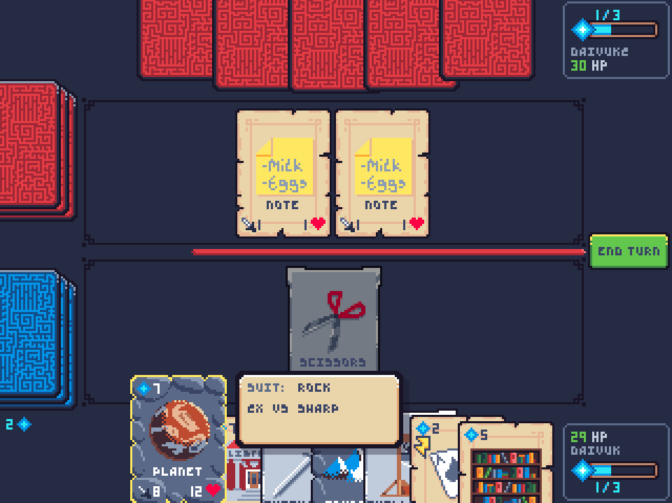

# War Stone #
Turned Based card game, built as an example for brainCloud real-time Room Server Manager (RSM) and real-time Matchmaking



## Play the game ##
To play the game now, follow this link:
http://ec2-18-219-26-183.us-east-2.compute.amazonaws.com:3000/

## How to run your instance ##
You might want to modify this example, for your individual needs and debugging purposes. 

To further familiarize yourself with the system, it is a good idea to try to run your own War Stone project.

### Portal setup ###
We first need to create the application in the brainCloud portal, then upload configuration that defines the settings and rules of the game.
1. Create a new app, call it `War Stone` or your chosen project name.

2. In the **Design / Core App Info / Admin Tools** section of the portal, then **Import Configuration Data** from `portal-configs/configuration-data.bcconfig`.
3. In the **Design / Cloud Code / Web Services** section of the portal, edit the **Base URL** of the **RSM** service. By default, it points to the example RSM instance.
4. Now in the portal, go in the section **Monitoring / Global Entities** and **Bulk Actions / Import from Raw JSON Object file** from `portal-configs/global-entities_raw.json`

### Run the server ###
1. Clone the RSM example from here: https://github.com/getbraincloud/rsm-example
2. Make sure your router allows for TCP ports 9306/9308/9310. If you wish to change the ports, check in the file `server/Scripts/main.js` for `TCP_PORT`, `HTTP_PORT` and `WS_PORT`.

   Don't forget to update the URL for the RSM in the portal.
3. In the file `server/Scripts/S2S.js`, fill in the following information:
   ```
   const APP_ID = "...";
   ```
   Found in **Design / Core App Info / Application IDs**
   ```
   const SERVER_SECRET = "...";
   ```
   Found in **Design /  Cloud Code / S2S Config / RSM**
4. It's a nodejs project that you can simply start with:
   ```
   cd server/
   node Scripts/main.js
   ```

### Run the client ###
1. Clone the WarStone example from here: https://github.com/getbraincloud/warstone

2. In the file `src/App.js`, fill in the following in formation:
   ```
   let appId = "..."
   let appSecret = "..."
   ```
   Found in **Design / Core App Info / Application IDs**
3. Install npm modules: `npm install`
4. Run: `npm start`
